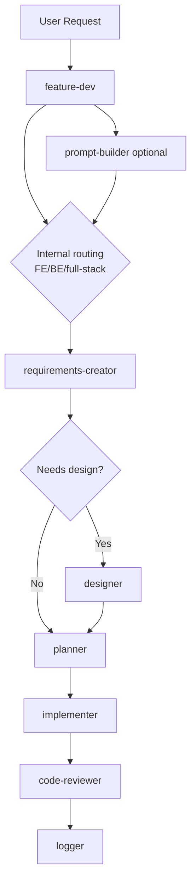

# Feature Dev Workflow

Feature Dev Workflow is a multi-agent setup built around a single orchestrator, `feature-dev`, that delegates work to specialized agents for prompt refinement, requirements, design, planning, implementation, review, and logging.

The repository ships two variants:

- `.github/agents` is the active VS Code-oriented setup.
- `portable/agents` is a runtime-neutral baseline already prepared to be placed into provider-specific folders depending on the target CLI or host.

The main goal is simple: move fast without collapsing everything into one oversized chat context.

## Highlights

- Single orchestration entry point with `feature-dev`
- Optional `prompt-builder` for vague or under-scoped requests
- Internal routing as `frontend`, `backend`, or `full-stack`
- Conditional `designer` phase only when the feature has a real user-facing surface
- Mandatory gated approvals through `vscode/askQuestions`
- Parallel implementation waves managed by `planner`
- Dedicated `code-reviewer` approval step before closeout
- Checkpoint and synthesis logging through `logger`
- Repository-local layout ready to be shared on GitHub

## Why the VS Code Variant Matters

The strongest version of this workflow is the VS Code one because it can rely on native tools instead of forcing every approval step into normal chat turns.

In particular, `vscode/askQuestions` is not just a UX detail. It is a cost and control advantage: the workflow can stop at the right checkpoints, ask for explicit approval, and continue only when needed without burning extra premium requests on avoidable back-and-forth. That keeps the gated workflow strict while making the orchestration materially more efficient.

## Agent Architecture

### Orchestrator

- [feature-dev.agent.md](.github/agents/feature-dev.agent.md)
  - Owns the full workflow.
  - Handles routing, approvals, and phase transitions.
  - Treats FE/BE classification as an internal routing decision, not a standalone logged phase.

### User-Facing Agents

- [prompt-builder.agent.md](.github/agents/prompt-builder.agent.md)
  - Refines raw requests into approved prompts.
  - Explicitly classifies requests as `frontend`, `backend`, or `full-stack`.

- [logger.agent.md](.github/agents/logger.agent.md)
  - Saves phase summaries, feature summaries, notes, and ADR-style documentation.

### Subagents

- [requirements-creator.subagent.agent.md](.github/agents/requirements-creator.subagent.agent.md)
  - Expands the approved prompt into structured requirements.

- [designer.subagent.agent.md](.github/agents/designer.subagent.agent.md)
  - Produces UX concepts and static prototypes for frontend-facing work.

- [planner.subagent.agent.md](.github/agents/planner.subagent.agent.md)
  - Breaks the approved scope into implementation waves and dependencies.

- [implementer.subagent.agent.md](.github/agents/implementer.subagent.agent.md)
  - Implements individual tasks and writes tests.

- [code-reviewer.subagent.agent.md](.github/agents/code-reviewer.subagent.agent.md)
  - Reviews correctness, security, maintainability, and test coverage.

### Skill

- [frontend-design/SKILL.md](.github/skills/frontend-design/SKILL.md)
  - Used by the Designer to improve frontend quality and visual direction.

## Workflow

At runtime, the workflow looks like this:

1. Prompt intake
2. Internal routing as `frontend`, `backend`, or `full-stack`
3. Requirements creation
4. Optional design phase
5. Planning
6. Implementation
7. Code review
8. Logging and closeout

Important behavior:

- `prompt-builder` is optional.
- FE/BE/full-stack detection always happens, but it is not logged as a dedicated phase.
- Backend-only work skips `designer`.
- Only phases that actually run are checkpointed by `logger`.

## Flow Diagram



## Quick Start

### Prerequisites

For the VS Code variant, you need:

- VS Code with GitHub Copilot custom agents support
- GitHub Copilot access enabled for chat and agents
- A git repository for the target project
- Agent discovery from `.github/agents`

If your environment does not automatically discover repository-local agents, verify the relevant VS Code settings such as `chat.agentFilesLocations`.

If you want to run the workflow in a different runtime (CLAUDE, CODEX, etc), you can copy the portable agents into the folder structure expected by your target environment.

### Setup

```bash
git clone https://github.com/Elverle/feature-workflow
cd feature-workflow
```

Open the repository in VS Code. The agents are versioned directly in `.github/agents`, so the project is already structured for repository-based sharing.

If you want to adapt the workflow to another runtime, start from `portable/agents`: those files are already generalized and ready to be copied into the folder structure expected by the target tool (es .claude/.codex).

### Use the Right Entry Point

- Use `feature-dev` for the full orchestrated workflow.
- Use `prompt-builder` when the request is still too vague.
- Use `logger` when you want to document decisions or notes outside the main workflow.

## Repository Structure

```text
.
|-- README.md
|-- .github/
|   |-- agents/
|   |   |-- feature-dev.agent.md
|   |   |-- prompt-builder.agent.md
|   |   |-- logger.agent.md
|   |   |-- requirements-creator.subagent.agent.md
|   |   |-- designer.subagent.agent.md
|   |   |-- planner.subagent.agent.md
|   |   |-- implementer.subagent.agent.md
|   |   `-- code-reviewer.subagent.agent.md
|   `-- skills/
|       `-- frontend-design/
|           `-- SKILL.md
|-- docs/
|-- portable/
|   |-- agents/
|   `-- docs/
`-- feature/
    `-- feature-{number}/
```

Notes:

- `feature/` is a generated output area used by the workflow at runtime.
- `docs/` is available for project documentation and examples.
- `portable/` contains the runtime-neutral agent copies for non-VS Code environments.

## Examples

### Backend-Only Request

```text
Skip prompt building. I need an internal batch job that reconciles supplier payouts.
```

What happens:

1. `feature-dev` accepts the user request as the approved prompt.
2. It classifies the feature as `backend`.
3. It invokes `requirements-creator`.
4. It skips `designer`.
5. It invokes `planner`, `implementer`, `code-reviewer`, and `logger`.

### Full-Stack Request

```text
Build a dashboard for tracking payout reconciliation and add the backend endpoints that power it.
```

What changes:

1. The workflow classifies the feature as `full-stack`.
2. `designer` is invoked after approved requirements.
3. The generated design artifacts are passed into `planner` and then into `implementer`.

## Generated Artifacts

The workflow writes feature artifacts under `feature/feature-{number}/`.

Typical outputs include:

- `prompt.md` when `prompt-builder` ran
- `requirements.md`
- `implementation-plan.md`
- `00-feature-summary.md`
- `01-prompt-builder-summary.md` when the prompt phase ran
- `02-requirements-summary.md`
- `03-designer-summary.md` when the design phase ran
- `04-planner-summary.md`
- `05-implementer-summary.md`
- `06-code-review-summary.md`
- `prototypes/design-preview.html` when the design phase ran
- `decisions/` and `notes/` for additional feature documentation

At repository level, the workflow can also maintain `feature-index.md`.

## Why This Setup Works

- The orchestrator keeps control of routing and approvals.
- The VS Code variant is operationally stronger because native tools such as `vscode/askQuestions` reduce unnecessary premium-request consumption during approval gates.
- Specialized agents keep context narrower and more reliable.
- Backend work is not forced through unnecessary design steps.
- The workflow preserves a useful documentation trail without over-logging internal routing decisions.
