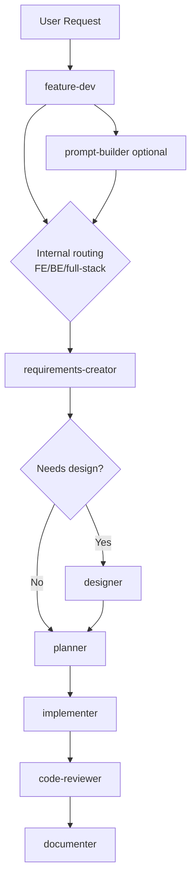

# Feature Workflow

**Move fast without collapsing everything into one oversized chat context.**

Feature Dev Workflow is a multi-agent setup built around a single orchestrator, `feature-dev`, that delegates work to specialized agents for prompt refinement, requirements, design, planning, implementation, review, and logging.

The repository ships two variants:

- `.github/agents` is the active VS Code-oriented setup.
- `portable/agents` is a runtime-neutral baseline ready to be dropped into provider-specific folders. See the [Claude Code setup](#claude-code-setup) section below for concrete instructions.

## Why This Setup Works

A single-agent workflow collapses all concerns into one growing context. As scope expands, quality degrades. This workflow keeps each agent focused on a narrow responsibility, so context stays tight and outputs stay reliable.

The orchestrator, `feature-dev`, owns routing and approvals. Specialized subagents handle the rest. Backend work skips the design phase entirely. Only phases that actually run are logged.

The VS Code variant is operationally stronger because it uses native tools like `vscode/askQuestions` for approval gates. This is not just a UX detail: it prevents unnecessary premium-request consumption during checkpoints and keeps the workflow strict without burning tokens on avoidable back-and-forth.

## Agent Architecture

### Orchestrator

- [feature-dev.agent.md](.github/agents/feature-dev.agent.md)
  - Owns the full workflow.
  - Handles routing, approvals, and phase transitions.
  - Treats FE/BE classification as an internal routing decision, not a standalone logged phase.

### User-Facing Agents

- [prompt-builder.agent.md](.github/agents/prompt-builder.agent.md)
  - Refines raw requests into approved prompts.
  - Explicitly classifies requests as `frontend`, `backend`, or `full-stack`.

- [documenter.agent.md](.github/agents/documenter.agent.md)
  - Saves phase checkpoints, final feature summaries, notes, and ADR-style documentation.

### Subagents

- [requirements-creator.subagent.agent.md](.github/agents/requirements-creator.subagent.agent.md)
  - Expands the approved prompt into structured requirements.

- [designer.subagent.agent.md](.github/agents/designer.subagent.agent.md)
  - Produces UX concepts and static prototypes for frontend-facing work.

- [planner.subagent.agent.md](.github/agents/planner.subagent.agent.md)
  - Breaks the approved scope into implementation waves and dependencies.

- [implementer.subagent.agent.md](.github/agents/implementer.subagent.agent.md)
  - Implements individual tasks and writes tests.

- [code-reviewer.subagent.agent.md](.github/agents/code-reviewer.subagent.agent.md)
  - Reviews correctness, security, maintainability, and test coverage.

### Skill

- [frontend-design/SKILL.md](.github/skills/frontend-design/SKILL.md)
  - Used by the Designer to improve frontend quality and visual direction.

## Workflow

At runtime, the workflow executes in this order:

1. Prompt intake
2. Internal routing as `frontend`, `backend`, or `full-stack`
3. Requirements creation
4. Optional design phase (frontend and full-stack only)
5. Planning
6. Implementation
7. Code review
8. Logging and closeout

Key behaviors:

- `prompt-builder` is optional. If the request is already well-scoped, `feature-dev` accepts it directly.
- FE/BE/full-stack detection always happens, but it is not logged as a dedicated phase.
- Backend-only work skips `designer`.
- Every approved phase that actually runs is checkpointed by `documenter`, followed by a final synthesis pass at closeout.

## Flow Diagram



## Quick Start

### VS Code Setup

Prerequisites:

- VS Code with GitHub Copilot custom agents support
- GitHub Copilot access enabled for chat and agents
- A git repository for the target project
- Agent discovery from `.github/agents`

If your environment does not automatically discover repository-local agents, verify the relevant VS Code settings such as `chat.agentFilesLocations`.

```bash
git clone https://github.com/Elverle/feature-workflow
cd feature-workflow
```

Open the repository in VS Code. The agents are versioned directly in `.github/agents`, so the project is already structured for repository-based sharing.

### Claude Code Setup

`portable/agents` contains runtime-neutral agent files with no VS Code-specific tooling. These are designed to be dropped into Claude Code's custom agent directory without modification.

**Step 1 — Clone the repository**

```bash
git clone https://github.com/Elverle/feature-workflow
cd feature-workflow
```

**Step 2 — Copy the portable agents into your target project**

Claude Code discovers agents from the `.claude/agents/` folder at the root of your project. Copy the portable agents there:

```bash
cp portable/agents/*.md /path/to/your-project/.claude/agents/
```

If `.claude/agents/` does not exist yet, create it first:

```bash
mkdir -p /path/to/your-project/.claude/agents/
```

**Step 3 — Copy the frontend-design skill (optional)**

If your project includes frontend work and you want the designer subagent to use the skill, copy it as well:

```bash
mkdir -p /path/to/your-project/.claude/skills/frontend-design/
cp .github/skills/frontend-design/SKILL.md /path/to/your-project/.claude/skills/frontend-design/
```

**Step 4 — Start the workflow**

Open Claude Code in your project and invoke the orchestrator:

```
@feature-dev Build a dashboard for tracking payout reconciliation and add the backend endpoints that power it.
```

**Approval gates in Claude Code**

The VS Code variant uses `vscode/askQuestions` for gated approvals. In Claude Code, the portable agents fall back to standard chat-turn confirmations: the orchestrator will ask for explicit approval at each checkpoint before continuing. This is slightly less efficient in token usage but functionally equivalent.

**Differences from the VS Code variant**

| Capability                | VS Code                      | Claude Code                 |
| ------------------------- | ---------------------------- | --------------------------- |
| Approval gates            | Native `vscode/askQuestions` | Chat-turn confirmations     |
| Agent discovery           | `.github/agents/`            | `.claude/agents/`           |
| File write tools          | Native VS Code filesystem    | Claude Code bash/edit tools |
| Token efficiency at gates | Higher                       | Slightly lower              |

### Use the Right Entry Point

- Use `feature-dev` for the full orchestrated workflow.
- Use `prompt-builder` when the request is still too vague to scope.
- Use `documenter` when you want to document decisions or notes outside the main workflow.

## Examples

### Backend-Only Request

```text
Skip prompt building. I need an internal batch job that reconciles supplier payouts.
```

What happens:

1. `feature-dev` accepts the user request as the approved prompt.
2. It classifies the feature as `backend`.
3. It invokes `requirements-creator`.
4. It skips `designer`.
5. It invokes `planner`, `implementer`, `code-reviewer`, and `documenter`.

### Full-Stack Request

```text
Build a dashboard for tracking payout reconciliation and add the backend endpoints that power it.
```

What changes:

1. The workflow classifies the feature as `full-stack`.
2. `designer` is invoked after approved requirements.
3. The generated design artifacts are passed into `planner` and then into `implementer`.

## Generated Artifacts

The workflow writes feature artifacts under `feature/feature-{number}/`.

Typical outputs include:

- `prompt.md` when `prompt-builder` ran
- `requirements.md`
- `implementation-plan.md`
- `00-feature-summary.md`
- `01-prompt-builder-summary.md` when the prompt phase ran
- `02-requirements-summary.md`
- `03-designer-summary.md` when the design phase ran
- `04-planner-summary.md`
- `05-implementer-summary.md`
- `06-code-review-summary.md`
- `prototypes/design-preview.html` when the design phase ran
- `decisions/` and `notes/` for additional feature documentation

At repository level, the workflow can also maintain `feature-index.md`.

## Repository Structure

```text
.
|-- README.md
|-- .github/
|   |-- agents/
|   |   |-- feature-dev.agent.md
|   |   |-- prompt-builder.agent.md
|   |   |-- documenter.agent.md
|   |   |-- requirements-creator.subagent.agent.md
|   |   |-- designer.subagent.agent.md
|   |   |-- planner.subagent.agent.md
|   |   |-- implementer.subagent.agent.md
|   |   `-- code-reviewer.subagent.agent.md
|   `-- skills/
|       `-- frontend-design/
|           `-- SKILL.md
|-- docs/
|-- portable/
|   |-- agents/
|   `-- docs/
`-- feature/
    `-- feature-{number}/
```

Notes:

- `feature/` is a generated output area used by the workflow at runtime.
- `docs/` is available for project documentation and examples.
- `portable/` contains the runtime-neutral agent copies for non-VS Code environments.
